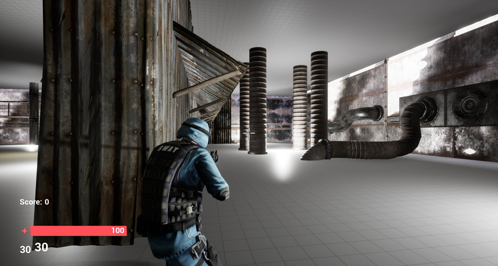

# UE4_ZombieShooter

  This is more or less my first 'finished' game in Unreal Engine. 

  Players objective is to survive as long as possible,
  killing zombies in order to progress rounds and gain score points. Score points don't really do anything right now, they're
  just a symbol of how far the player has progressed in the game.

  <b> Controls </b>
  <ul>
    <li>Forward: W </li>
    <li>Backward: S </li>
    <li>Right: D </li>
    <li>Left: A </li>
    <li>Jump: Spacebar </li>
    <li>Shoot: LMB </li>
    <li>Aim Down Sight: RMB </li>
    <li>Pause: P or ESC </li>
  </ul>

  <b> Pictures </b>

